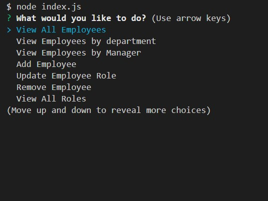
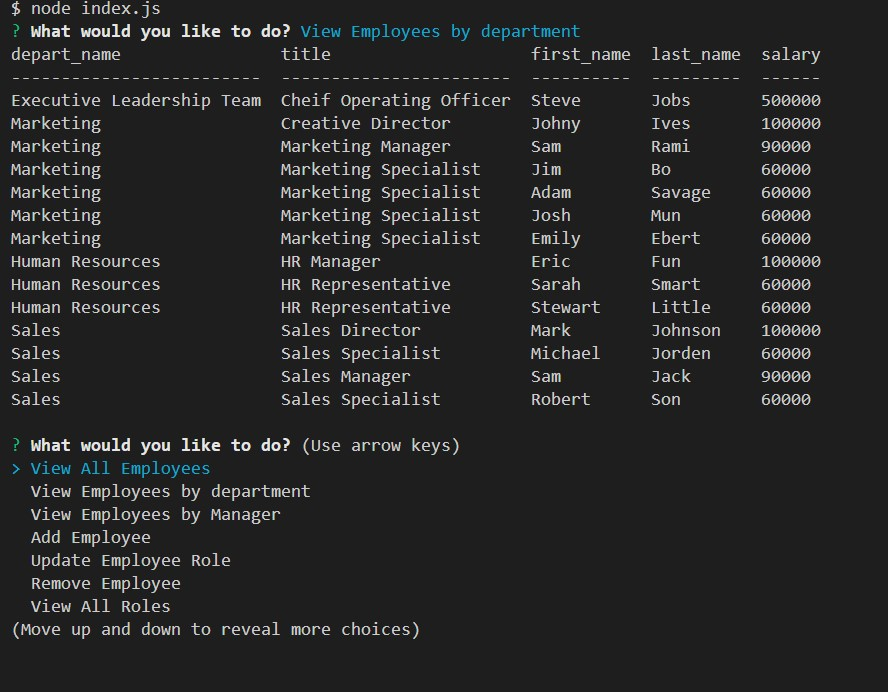

# Employee Tracker

## Description

Use this employee contact management system to view, add, delete Employees, Departments, Roles. This application makes it easy to track your company employees. 

## How to use
To use this employee tracker, simply install the application. Using node in the terminal launch the applicaiton and start adding employees. Assign them to departments give them roles and salaries. Keep everything organized!

Don't forget to add your own config folder and modify the credsExample.js file to use your own MySQL database username and password.

## Github Repo Link
https://github.com/adamnatrop/employee_tracker

## Walkthrough Video Link

Click on the link to watch a walkthrough video on how to use the Employee Tracker

https://vimeo.com/536625651/cbf4c8fc6f

## Screenshots 

Launch node index.js 

